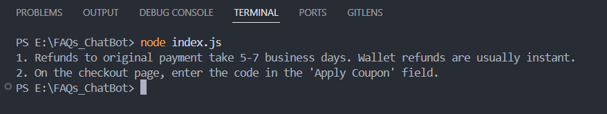

# QuickBite-FAQ-Chatbot

A simple **FAQ-based customer support chatbot** built using **Node.js** and the **OpenAI SDK (via OpenRouter)**.
The chatbot answers user queries related to the **QuickBite food delivery service** using a predefined FAQ dataset and responds only with the information available in that dataset.

## Demo



## Features

* Answers customer questions using a **QuickBite FAQ knowledge base**
* Prevents responses outside the provided FAQ dataset
* Handles **out-of-scope questions** with a default support message
* Maintains a **polite and empathetic tone**
* Avoids asking for **sensitive information** such as passwords, OTPs, or card numbers
* Simple **command-line chatbot interface**

## How It Works

The chatbot sends user queries to an AI model along with a **system prompt containing the QuickBite FAQ and guardrail rules**.
The model generates responses strictly based on the provided FAQ data.

If a question is not present in the FAQ or unrelated to QuickBite services, the chatbot replies:

> "I don't have information on that. Please contact [support@quickbite.com](mailto:support@quickbite.com)."

## Project Structure

```text
FAQs_ChatBot
│
├── index.js        # Main chatbot program
├── faq.json        # FAQ dataset used as the chatbot knowledge base
├── package.json    # Project dependencies
├── .env.example    # Environment variables template
└── README.md
```

## Technologies Used

* Node.js
* OpenAI SDK
* OpenRouter API
* dotenv
* JSON
